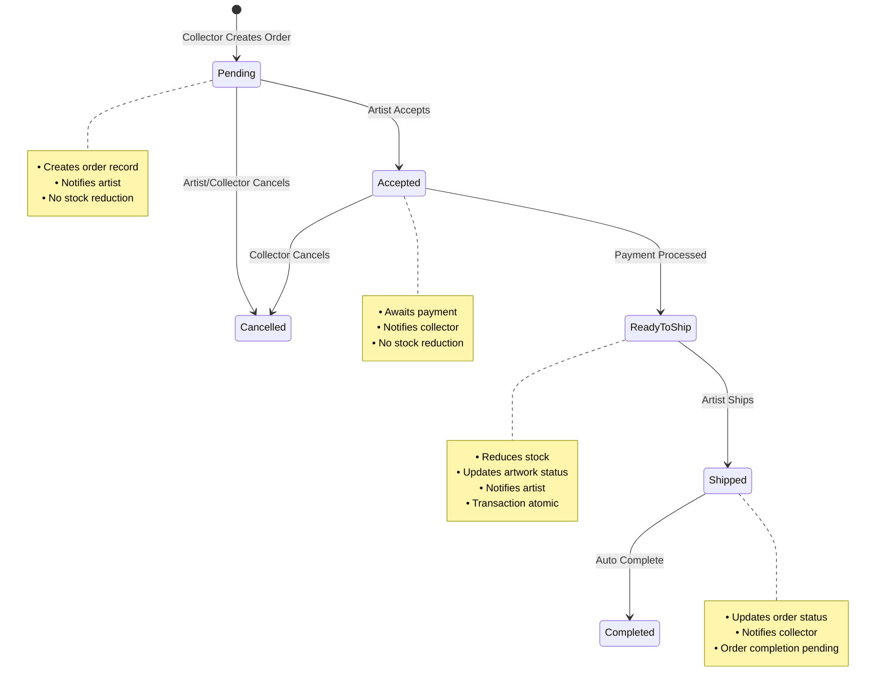
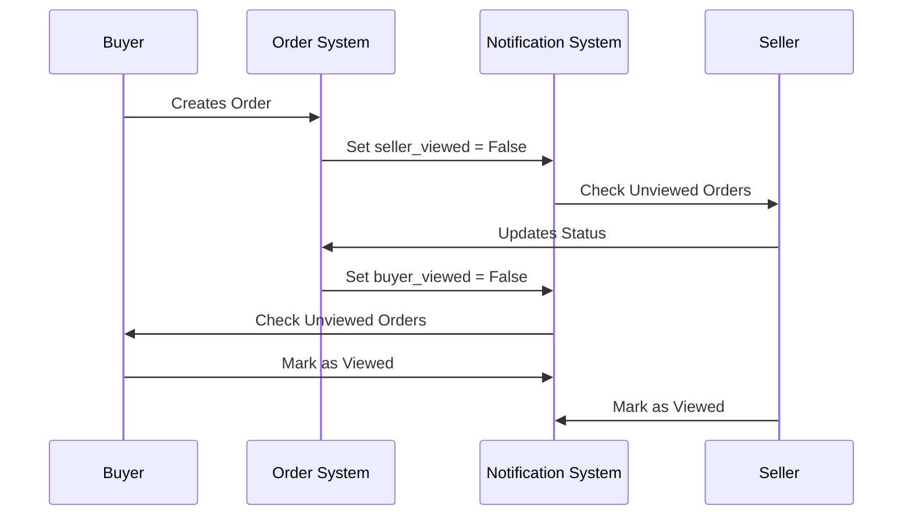
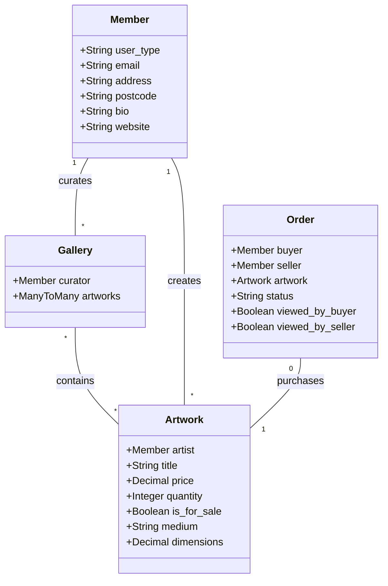

# OpenStudio API

## Project Context

OpenStudio is a full-featured art marketplace platform built after one week of learning Python for the first time. The platform connects artists with collectors, enabling artwork sales and gallery curation. This repository contains the Django REST Framework backend API, with the frontend built in TypeScript available at [OpenStudio Frontend](https://github.com/milochambers96/OpenStudio-FE).

The live API can be accessed at [OpenStudio API](https://openstudio-api-dd90e294d836.herokuapp.com/), and the frontend app can be accessed at [OpenStudio](https://openstudio.netlify.app/).

### Development Timeline & Achievements

- Built over one week after initial week of Python learning
- First Python/Django project
- Includes complex features like order processing, gallery management, and notification systems
- Concurrent development of TypeScript frontend

### Key Accomplishments

- Built a complete e-commerce platform one week after learning Python
- Implemented complex features like atomic transactions and state management
- Created a notification system for real-time updates
- Developed a flexible serializer architecture for different data contexts
- Managed concurrent user types (artists/collectors) with specific permissions
- Integrated with Cloudinary for image management
- Deployed on Heroku with PostgreSQL database

## Tech Stack

- Python 3.11
- Django & Django REST Framework
- PostgreSQL
- JWT Authentication
- Django CORS Headers
- Django Environ
- Psycopg2
- dj-database-url (Heroku deployment)

## System Architecture and Data Flows

### Order Processing Flow



The above order process diagram illustrates the complete lifecycle of an order in the system:

- Orders begin in 'Pending' state when created by a collector
- Artists can accept or reject pending orders
- Once accepted, orders await payment processing
- After payment, stock is automatically adjusted and the order moves to shipping
- Each state transition triggers notifications to relevant parties
- Atomic transactions ensure data integrity during status changes

### Notification System Flow



The notification system manages real-time updates between buyers and sellers:

- Every order status change triggers a notification
- Separate tracking for buyer and seller notifications prevents missed updates
- Bulk update capabilities for marking multiple notifications as viewed
- System handles different notification types based on user roles
- Asymmetric notification flow ensures both parties stay informed of relevant changes

### Gallery-Artwork Relationship Flow



This class diagram shows the core relationships between system entities:

- Members can be either artists (creating artworks) or collectors (curating galleries)
- Galleries maintain many-to-many relationships with artworks through a join table
- Orders connect buyers and sellers through specific artworks
- Each entity contains essential fields for business operations
- The design supports complex queries and maintains referential integrity

## Installation and Setup

### Prerequisites

- Python 3.11
- PostgreSQL
- Pipenv
- Cloudinary account

### Local Development Setup

```bash
# Clone the repository
git clone <your-repo-url>
cd openstudio-backend

# Install dependencies
pipenv install

# Activate virtual environment
pipenv shell

# Set up environment variables
# Create a .env file with:
ENVIRONMENT=DEV
SECRET_KEY=your_secret_key
DATABASE_URL=your_database_url

# Create database
createdb openstudio-api

# Run migrations
python manage.py migrate

# Start development server
python manage.py runserver
```

## Data Models

### Member Model

```python
class Member(AbstractUser):
    USER_TYPE_CHOICES = [
        ('artist', 'Artist'),
        ('collector', 'Collector'),
    ]
    email = models.CharField(max_length=50, unique=True)
    first_name = models.CharField(max_length=50)
    last_name = models.CharField(max_length=50)
    address = models.CharField(max_length=255)
    postcode = models.CharField(max_length=255)
    user_type = models.CharField(max_length=10, choices=USER_TYPE_CHOICES)

    # Artist-specific fields
    bio = models.TextField(validators=[MaxLengthValidator(700)], blank=True)
    website = models.URLField(max_length=200, blank=True)

    def __str__(self):
        return f'{self.username} - {self.user_type}'
```

### Artwork Model

```python
class Artwork(models.Model):
    MEDIUM_CHOICES = [
        ('painting', 'Painting'),
        ('sculpture', 'Sculpture'),
        ('digital_art', 'Digital Art'),
        ('photography', 'Photography'),
        ('mixed_media', 'Mixed Media'),
        ('printmaking', 'Printmaking'),
        ('ceramics', 'Ceramics'),
        ('textile', 'Textile Art'),
    ]
    title = models.CharField(max_length=100)
    artist = models.ForeignKey(
        "members.Member",
        related_name="artworks",
        on_delete=models.CASCADE
    )
    description = models.TextField(validators=[MaxLengthValidator(300)])
    year = models.IntegerField()
    price = models.DecimalField(max_digits=7, decimal_places=2)
    quantity_for_sale = models.IntegerField()
    is_for_sale = models.BooleanField(default=True)
    medium = models.CharField(max_length=30, choices=MEDIUM_CHOICES)
    material = models.CharField(max_length=50)
    width = models.DecimalField(
        max_digits=6,
        decimal_places=2,
        help_text="Width in cm"
    )
    depth = models.DecimalField(
        max_digits=6,
        decimal_places=2,
        help_text="Depth in cm"
    )
    height = models.DecimalField(
        max_digits=6,
        decimal_places=2,
        help_text="Height in cm"
    )
    weight = models.DecimalField(
        max_digits=6,
        decimal_places=2,
        help_text="Weight in kg"
    )

    def __str__(self):
        return f'{self.title} by {self.artist}'
```

### Gallery Model

```python
class Gallery(models.Model):
    curator = models.ForeignKey(
        'members.Member',
        related_name='galleries',
        on_delete=models.CASCADE
    )
    artworks = models.ManyToManyField(
        'artworks.Artwork',
        through='GalleryArtwork'
    )

    def __str__(self):
        return f'Gallery curated by {self.curator.username}.'

class GalleryArtwork(models.Model):
    gallery = models.ForeignKey(Gallery, on_delete=models.CASCADE)
    artwork = models.ForeignKey('artworks.Artwork', on_delete=models.CASCADE)

    def __str__(self):
        return f"{self.artwork.title} in {self.gallery.curator.username}'s gallery."
```

### Order Model

```python
class Order(models.Model):
    STATUS_CHOICES = [
        ('pending', 'Pending'),
        ('accepted', 'Accepted'),
        ('ready to ship', 'Ready to Ship'),
        ('shipped', 'Shipped'),
        ('completed', 'Completed'),
        ('cancelled', 'Cancelled')
    ]
    buyer = models.ForeignKey(
        "members.Member",
        related_name="buyer_orders",
        on_delete=models.CASCADE
    )
    seller = models.ForeignKey(
        "members.Member",
        related_name="seller_orders",
        on_delete=models.CASCADE
    )
    artwork = models.ForeignKey(
        "artworks.Artwork",
        related_name="orders",
        on_delete=models.CASCADE
    )
    price = models.DecimalField(max_digits=7, decimal_places=2)
    created_at = models.DateTimeField(auto_now_add=True)
    status = models.CharField(max_length=30, choices=STATUS_CHOICES)
    viewed_by_buyer = models.BooleanField(default=False)
    viewed_by_seller = models.BooleanField(default=False)

    def __str__(self):
        return f'Order {self.id} between {self.buyer.username} & {self.seller.username}'

    def mark_viewed_by_buyer(self):
        self.viewed_by_buyer = True
        self.save()

    def mark_viewed_by_seller(self):
        self.viewed_by_seller = True
        self.save()
```

## Authentication Implementation

### JWT Authentication Class

```python
class JWTAuthentication(BasicAuthentication):
    def authenticate(self, request):
        header = request.headers.get("Authorization")
        if not header:
            return None

        if not header.startswith("Bearer"):
            raise PermissionDenied(detail="Invalid authorization token")

        token = header.replace("Bearer ", "")

        try:
            payload = jwt.decode(
                token,
                settings.SECRET_KEY,
                algorithms=['HS256']
            )
            member = Member.objects.get(pk=payload.get('sub'))
        except jwt.exceptions.InvalidTokenError:
            raise PermissionDenied(detail="Invalid authorization token")
        except Member.DoesNotExist:
            raise PermissionDenied(detail="Member not found")

        return (member, token)
```

## Technical Implementation Deep Dive

This section details the key technical challenges and solutions implemented in the week following initial Python learning. The project required rapid understanding of Django REST Framework concepts, complex state management, and transaction handling.

### Key Technical Challenges Overcome

1. **Multiple User Types and Access Control**

   - Managing different serializers for artists and collectors
   - Automatic gallery creation for collectors
   - Role-based access control for different endpoints

2. **Complex State Management**

   - Order status transitions with validation
   - Notification system for both buyers and sellers
   - Stock management with transaction integrity

3. **Data Integrity and Race Conditions**
   - Atomic transactions for order processing
   - Preventing overselling through stock management
   - Handling concurrent gallery updates

### Serializer Architecture

The platform implements a sophisticated multi-serializer pattern to handle different data presentation needs while maintaining DRY principles. This was particularly challenging to implement as a first Python project.

#### Key Implementation Challenges:

1. **Context-Specific Data Exposure**

```python
# Base serializer for general use
class MemberSerializer(serializers.ModelSerializer):
    password = serializers.CharField(write_only=True)
    password_confirmation = serializers.CharField(write_only=True)

    def validate(self, data):
        # Custom password validation with error handling
        password = data.pop("password")
        password_confirmation = data.pop("password_confirmation")

        # Validation with specific error messages
        if password != password_confirmation:
            raise ValidationError({
                'password_confirmation': 'passwords do not match'
            })

        try:
            # Utilize Django's built-in validation
            password_validation.validate_password(password)
        except ValidationError as err:
            raise ValidationError({'password': err.messages})

        data['password'] = make_password(password)
        return data

    class Meta:
        model = Member
        fields = (
            'id', 'email', 'username', 'first_name', 'last_name',
            'password', 'password_confirmation', 'user_type',
            'address', "postcode"
        )

# Specialized serializers for specific use cases
class BuyerSerializer(serializers.ModelSerializer):
    """
    Focused serializer for order processing - only exposes
    necessary shipping information
    """
    class Meta:
        model = Member
        fields = ['id', 'username', 'address', 'postcode']

class SellerSerializer(serializers.ModelSerializer):
    """
    Extended information for customer communication
    """
    class Meta:
        model = Member
        fields = [
            'id', 'username', 'address', 'postcode',
            'first_name', 'last_name'
        ]

# Simplified serializer for nested relationships
class SimpleMemberSerializer(serializers.ModelSerializer):
    """
    Minimal information for nested relationships to prevent
    circular dependencies and reduce payload size
    """
    class Meta:
        model = Member
        fields = ['id', 'first_name', 'last_name', 'username']
```

### Complex Registration Flow

The registration process handles multiple user types and automatically creates associated resources:

```python
class RegisterView(APIView):
    def post(self, request):
        member_to_create = MemberSerializer(data=request.data)

        try:
            with transaction.atomic():  # Ensure all operations succeed or none
                if member_to_create.is_valid():
                    # Create member instance
                    new_member_instance = member_to_create.save()

                    # Automatic gallery creation for collectors
                    if new_member_instance.user_type == 'collector':
                        Gallery.objects.create(curator=new_member_instance)

                    return Response({
                        "message": "Registration Successful. Welcome to the studio.",
                    }, status=status.HTTP_201_CREATED)

                # Detailed error handling
                error_messages = []
                for field, errors in member_to_create.errors.items():
                    for error in errors:
                        error_messages.append(
                            f"{field.replace('_', ' ').capitalize()}: {error}"
                        )

                return Response({
                    "message": "Registration failed. Please correct the following errors:",
                    "errors": error_messages
                }, status=status.HTTP_400_BAD_REQUEST)

        except Exception as err:
            # Roll back on any errors
            return Response({
                "message": "Registration failed due to server error",
                "errors": str(err)
            }, status=status.HTTP_500_INTERNAL_SERVER_ERROR)
```

### Notification Management System

The notification system handles complex state management between buyers and sellers:

```python
class UnviewedOrdersView(APIView):
    permission_classes = [IsAuthenticated]

    def get(self, request):
        user = request.user
        logger.info(f"Checking unviewed orders for user: {user.username}")

        try:
            # Different notification logic based on user type
            if user.user_type == 'collector':
                has_unviewed_orders = Order.objects.filter(
                    buyer=user,
                    viewed_by_buyer=False
                ).exists()
            elif user.user_type == 'artist':
                has_unviewed_orders = Order.objects.filter(
                    seller=user,
                    viewed_by_seller=False
                ).exists()
            else:
                logger.error(f"Invalid user type: {user.user_type}")
                return Response(
                    {"error": "Invalid user type"},
                    status=status.HTTP_400_BAD_REQUEST
                )

            return Response({
                "has_unviewed_orders": has_unviewed_orders
            })
        except Exception as e:
            logger.error(f"Error in UnviewedOrdersView: {str(e)}")
            return Response(
                {"error": str(e)},
                status=status.HTTP_400_BAD_REQUEST
            )

class MarkOrdersViewedView(APIView):
    permission_classes = [IsAuthenticated]

    def post(self, request):
        user = request.user
        user_type = request.data.get('user_type')

        try:
            with transaction.atomic():
                # Validate user type
                if user_type not in ['artist', 'collector']:
                    return Response(
                        {"error": "Invalid user type"},
                        status=status.HTTP_400_BAD_REQUEST
                    )

                # Bulk update based on user type
                if user_type == 'artist':
                    updated = Order.objects.filter(
                        seller=user,
                        viewed_by_seller=False
                    ).update(viewed_by_seller=True)
                else:  # collector
                    updated = Order.objects.filter(
                        buyer=user,
                        viewed_by_buyer=False
                    ).update(viewed_by_buyer=True)

                return Response({
                    "message": f"Marked {updated} orders as viewed"
                }, status=status.HTTP_200_OK)

        except Exception as e:
            logger.error(f"Error marking orders viewed: {str(e)}")
            return Response(
                {"error": "Failed to update order status"},
                status=status.HTTP_500_INTERNAL_SERVER_ERROR
            )
```

### Key Technical Solutions

#### 1. Stock Management

The challenge of managing artwork stock levels during order processing was solved using Django's transaction atomic decorator and careful status management:

```python
@transaction.atomic
def process_order_payment(order_id, user):
    """
    Processes payment and updates stock atomically
    """
    order = get_object_or_404(Order, pk=order_id, buyer=user)

    # Verify order status
    if order.status != 'accepted':
        raise ValidationError('Order is not accepted yet.')

    # Verify stock availability
    artwork = order.artwork
    if artwork.quantity_for_sale <= 0:
        raise ValidationError('Artwork no longer available.')

    try:
        # Update order status
        order.status = 'ready to ship'
        order.viewed_by_seller = False  # Trigger seller notification
        order.save()

        # Update artwork inventory
        artwork.quantity_for_sale -= 1
        if artwork.quantity_for_sale <= 0:
            artwork.is_for_sale = False
        artwork.save()

        return order, artwork

    except Exception as e:
        # Transaction will automatically rollback
        logger.error(f"Error processing order: {str(e)}")
        raise
```

## API Endpoints

### Authentication

```http
POST /api/members/register/     # Register new user
POST /api/members/login/        # Login user
GET  /api/members/user/         # Get current user details
```

### Artworks

```http
GET    /api/artworks/          # List all artworks
POST   /api/artworks/create/   # Create new artwork
GET    /api/artworks/<id>/     # Get artwork details
PUT    /api/artworks/<id>/     # Update artwork
DELETE /api/artworks/<id>/     # Delete artwork
```

### Galleries

```http
GET    /api/galleries/my-gallery/           # Get user's gallery
GET    /api/galleries/<id>/artworks/        # Get gallery artworks
POST   /api/galleries/<id>/curate/          # Add artwork to gallery
DELETE /api/galleries/<id>/curate/          # Remove artwork from gallery
```

### Orders

```http
POST   /api/orders/create/                  # Create new order
GET    /api/orders/purchase-requests/       # List buyer's orders
GET    /api/orders/seller/                  # List seller's orders
PATCH  /api/orders/review/<id>             # Accept/reject order
PATCH  /api/orders/shipped/<id>            # Mark order as shipped
PATCH  /api/orders/cancel/<id>             # Cancel order
PATCH  /api/orders/payment/<id>            # Process payment
GET    /api/orders/unviewed-orders/        # Check for notifications
POST   /api/orders/mark-viewed/            # Clear notifications
```

## Deployment

The API is deployed and can be accessed at [https://openstudio-api-dd90e294d836.herokuapp.com/](https://openstudio-api-dd90e294d836.herokuapp.com/).

### Heroku Configuration

The project is configured for Heroku deployment using django-on-heroku:

```python
# settings.py
django_on_heroku.settings(locals())
```

Required environment variables:

```
SECRET_KEY=your_production_secret_key
ENVIRONMENT=PROD
DATABASE_URL=your_database_url
```

### Database Configuration

```python
DATABASES = {}
if ENV != 'DEV':
    DATABASES['default'] = dj_database_url.config(
        conn_max_age=600,
        ssl_require=True
    )
else:
    DATABASES['default'] = {
        'ENGINE': 'django.db.backends.postgresql_psycopg2',
        'NAME': 'openstudio-api',
        'HOST': 'localhost',
        'PORT': 5432
    }
```

## Future Enhancements

- Stripe payment integration
- Advanced artwork search and filtering
- Artist portfolio pages
- Shipping integration
- Social sharing functionality
- Review system
- Sales analytics

## Learning Outcomes

This project represents significant achievements in:

- Learning Python and Django fundamentals in one week, then applying that knowledge to build a complex application the following week
- Implementing complex state management
- Building RESTful APIs
- Managing authentication and authorization
- Handling complex database relationships
- Implementing error handling and data validation
- Understanding deployment processes
